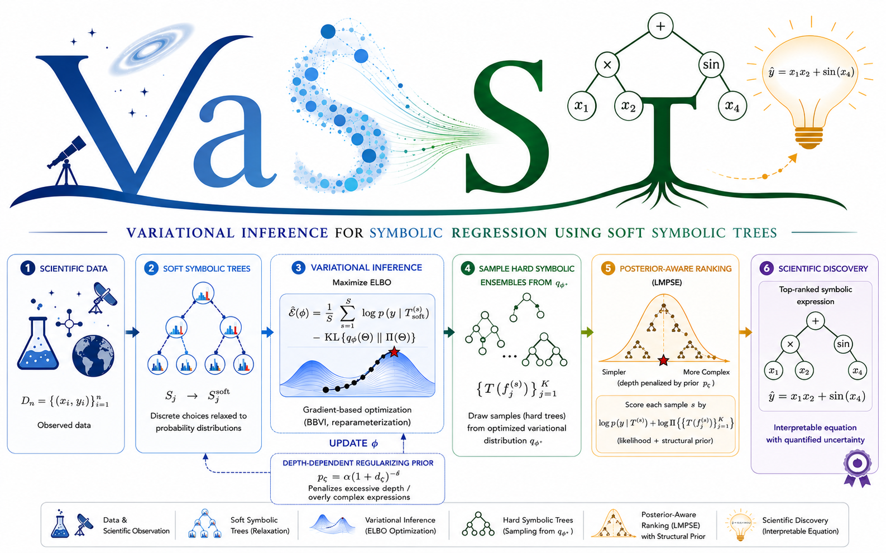

# VaSST: Variational Inference for Symbolic Regression using Soft Symbolic Trees

<p align="center">
  <a href="https://www.python.org/">
    
  </a>
  <a href="./LICENSE">
    
  </a>
  <a href="https://arxiv.org/abs/2602.23561">
    
  </a>
  <a href="https://github.com/Roy-SR-007/VaSST/network">
    
  </a>
  <a href="https://github.com/Roy-SR-007/VaSST">
    
  </a>
  <a href="https://github.com/Roy-SR-007/VaSST/commits/main">
    
  </a>
  <a href="https://github.com/Roy-SR-007/VaSST/issues">
    
  </a>
  <a href="https://github.com/Roy-SR-007/VaSST/pulls">
    
  </a>
</p>

`VaSST` is a probabilistic symbolic regression framework to learn interpretable scientific equations using ensembles of soft symbolic trees, trained using variational inference. Symbolic model selection is carried out using a posterior-aware score that accounts for uncertainty across competing symbolic structures.

This repository contains the source code for the `Python` implementation of `VaSST` proposed in Roy, S., Dey, P., & Mallick, B. K., *VaSST: Variational Inference for Symbolic Regression using Soft Symbolic Trees*. (Accepted at UAI, 2026; <https://arxiv.org/abs/2602.23561>).

<p align="center">
  
</p>

<p align="center">
  The complete VaSST pipeline.
</p>

---

## VaSST: Visual Walkthrough

https://github.com/user-attachments/assets/042f23b2-1c77-4665-bfc8-e84396f7a1ae
<p align="center">
  <em>Created with <a href="https://agentscreation.github.io/ageation/" target="_blank" rel="noopener noreferrer">Ageation</a></em>
</p>

---

## Developers and Maintainers

**Somjit Roy**  
Department of Statistics  
Texas A&M University, College Station, TX, USA  

📧 Email: [sroy_123@tamu.edu](mailto:sroy_123@tamu.edu)  
🌐 Website: [https://roy-sr-007.github.io](https://roy-sr-007.github.io)

**Pritam Dey**  
Department of Statistics  
Texas A&M University, College Station, TX, USA  

📧 Email: [pritam.dey@tamu.edu](mailto:pritam.dey@tamu.edu)  
🌐 Website: [https://pritamdey.github.io](https://pritamdey.github.io)

---

## Model Overview

$$y_i = \beta_0 + \sum_{k=1}^K \beta_k f_k(\boldsymbol{x}_i) + \epsilon_i, \quad \epsilon_i\sim \mathrm{N}(0, \sigma^2).$$

* Each $f_k(\boldsymbol{x})$ is a symbolic expression with a tree representation $\mathsf{T}(f_k)$.
* Priors are endowed upon regression parameters and symbolic tree structures.
* Trees are learned via soft relaxations.
* Coefficients are integrated out using collapsed Bayesian linear regression (BLR).

---

## Install Required Dependencies

```bash
pip install torch numpy pandas tqdm
```

## Quick Start: A Minimal Working Example

Navigate through `example.ipynb` to run an example simulation for symbolic regression using `VaSST`. We unpack each of the corresponding ingredients below.

**NOTE**: This is a minimal working example to run `VaSST`. The parameter configurations chosen here may not necessarily match the configurations in the original manuscript of `VaSST`: *Variational Inference for Symbolic Regression using Soft Symbolic Trees*.

```python
# import the VaSST module
from VaSST import *

# simulate data: noiseless and noisy version
def simulate_data(n=2000, noise_std=0.1, seed=0, device="cpu", dtype=torch.float32):
    g = torch.Generator(device=device)
    g.manual_seed(seed)

    # features and response generation
    X = (2.0 * torch.pi) * torch.rand(n, 2, generator=g, device=device, dtype=dtype) - torch.pi
    y_clean = 6.0 * torch.sin(X[:, 0]) * torch.cos(X[:, 1])
    y = y_clean + noise_std * torch.randn(n, generator=g, device=device, dtype=dtype)

    return X, y, y_clean

device = "cuda" if torch.cuda.is_available() else "cpu"
dtype = torch.float32

X, y, y_clean = simulate_data(
    n=2000,
    noise_std=0.1,
    seed=0,
    device=device,
    dtype=dtype,
)

# custom operator set
ops = make_operator_set(["mul", "sin", "cos"])

model = VaSST(
    n_features=2,
    n_trees=3,        
    depth=3,         
    operators=ops,
    alpha_split=0.95,
    delta0=2.0,
    eta_op_prior=1.0,
    eta_ft_prior=1.0,
    blr_a0=2.0,
    blr_b0=2.0,
    blr_sigma0_scale=1.0,
    tau_e=1.0,
    tau_op=1.0,
    tau_ft=1.0,
    value_clip=1e3,
    use_tanh_clip=True,
    logits_clip=10.0,
    device=torch.device(device),
    dtype=dtype,
).to(device)

# training configuration
cfg = TrainConfig(
    lr=5e-5,
    n_steps=1000,
    mc_samples=8,
    grad_clip=1.0,
    tau_start=1.0,
    tau_end=0.5,
    tau_anneal_steps=600,
    jitter=1e-3,
    log_every=100,
    kl_warmup_steps=300,
    kl_start=0.0,
    kl_end=1.0,
)

# train
logs = train_VaSST(
    model=model,
    X=X,
    y=y,
    cfg=cfg,
    include_intercept=True,
    verbose=False,
    print_every=100,
    use_progress_bar=False,
)

# rank hard samples by LMPSE
expr_top_lmpse, beta_top_lmpse, expr_top_logm, beta_top_logm = rank_hard_tree_samples_by_lmpse(
    model=model,
    X=X,
    y=y,
    n_samples=5000,
    include_intercept=True,
    jitter=1e-3,
    standardize_xy=False,
    top_k=10,
    feature_names=["x0", "x1"],
)
```

---

## VaSST Class

### Constructor for Model Initialization

```python
VaSST(
n_features: int,
n_trees: int,
depth: int,
operators: Optional[List[OperatorSpec]] = None,
alpha_split: float = 0.95,
delta0: float = 2.0,
eta_op_prior: float = 1.0,
eta_ft_prior: float = 1.0,
blr_a0: float = 2.0,
blr_b0: float = 2.0,
blr_mu0: Optional[torch.Tensor] = None,
blr_sigma0_scale: float = 1.0,
tau_e: float = 1.0,
tau_op: float = 1.0,
tau_ft: float = 1.0,
value_clip: float = 1e3,
use_tanh_clip: bool = True,
logits_clip: float = 10.0,
device: Optional[torch.device] = None,
dtype: torch.dtype = torch.float32,
)
```

| Parameter | Type | Description |
|---|---:|---|
| `n_features` | `int` | Number of input covariates/features in the dataset. If the design matrix has shape `(n, p)`, then `n_features = p`. |
| `n_trees` | `int` | Number of soft symbolic trees in the ensemble. The model represents the response as an additive combination of symbolic tree outputs. |
| `depth` | `int` | Maximum depth of each symbolic tree. |
| `operators` | `List` | List of symbolic operators allowed in the trees, such as addition, subtraction, multiplication, sine, cosine, logarithm, exponential, or protected division. If `None`, the model uses a default operator set. |
| `alpha_split` | `float` | Baseline prior probability of expanding/splitting a nonterminal node. |
| `delta0` | `float` | Depth-decay parameter in the split prior. |
| `eta_op_prior` | `float` | Concentration parameter for the prior over operator choices. |
| `eta_ft_prior` | `float` | Concentration parameter for the prior over feature choices. |
| `blr_a0` | `float` | Shape hyperparameter for the Bayesian linear regression noise prior, usually an Inverse-Gamma prior on the residual variance. |
| `blr_b0` | `float` | Scale or rate hyperparameter for the Bayesian linear regression noise prior. Together, `blr_a0` and `blr_b0` define the prior over the residual variance. |
| `blr_mu0` | `torch.Tensor` | Prior mean vector for the Bayesian linear regression coefficients. If `None`, it is usually initialized as a zero vector. |
| `blr_sigma0_scale` | `float` | Prior covariance scale for the Bayesian linear regression coefficients. |
| `tau_e` | `float` | Temperature parameter for the Binary Concrete relaxation of node expansion indicators. Smaller values make expansion decisions closer to discrete 0/1 choices; larger values make them smoother. |
| `tau_op` | `float` | Temperature parameter for the Gumbel-Softmax relaxation over operator choices. Smaller values make operator selection sharper; larger values produce softer mixtures over operators. |
| `tau_ft` | `float` | Temperature parameter for the Gumbel-Softmax relaxation over feature choices. Smaller values make feature selection sharper; larger values produce softer feature mixtures. |
| `value_clip` | `float` | Numerical bound used to clip intermediate tree outputs. This prevents unstable symbolic expressions from producing extremely large values. |
| `use_tanh_clip` | `bool` | Whether to use smooth clipping through a `tanh` transformation instead of hard clipping. Smooth clipping is often more stable for gradient-based optimization. |
| `logits_clip` | `float` | Bound used to clip variational logits for expansion, operator, or feature probabilities. This prevents probabilities from becoming numerically degenerate too early. |
| `device` | `torch.device` | PyTorch device on which the model is stored and computed, such as CPU or GPU. If `None`, the default device is used. |
| `dtype` | `torch.dtype` | Floating-point precision used for tensors. Common choices are `torch.float32` for speed and `torch.float64` for higher numerical accuracy. |

---

### Training Configurations

```python
TrainConfig(
lr=1e-4,
n_steps=800,
mc_samples=100,
grad_clip=5.0,
tau_start=1.0,
tau_end=0.2,
tau_anneal_steps=600,
jitter=1e-3,
log_every=100,
kl_warmup_steps=300,
kl_start=0.0,
kl_end=1.0,
)
```

| Parameter | Type | Description |
|---|---:|---|
| `lr` | `float` | Learning rate for the optimizer. |
| `n_steps` | `int` | Total number of optimization steps used to train the variational parameters. |
| `mc_samples` | `int` | Number of Monte Carlo samples used per optimization step to estimate the stochastic variational objective. |
| `grad_clip` | `float` | Maximum gradient norm used for gradient clipping. |
| `tau_start` | `float` | Initial temperature for the continuous relaxations, such as Binary Concrete or Gumbel-Softmax. Higher temperature gives smoother, less discrete samples early in training. |
| `tau_end` | `float` | Final temperature after annealing. Lower temperature makes the relaxed tree decisions sharper and closer to discrete symbolic choices. |
| `tau_anneal_steps` | `int` | Number of training steps over which the temperature is annealed from `tau_start` to `tau_end`. After this many steps, the temperature usually remains fixed at `tau_end`. |
| `jitter` | `float` | Small positive value added to matrices, usually along the diagonal, to improve numerical stability in operations such as Cholesky decomposition or matrix inversion. |
| `log_every` | `int` | Frequency, in training steps, at which progress such as loss, ELBO, KL terms, or diagnostics is printed or recorded. |
| `kl_warmup_steps` | `int` | Number of steps over which the KL penalty is gradually increased. This helps the model first learn useful symbolic structures before being strongly regularized by the prior. |
| `kl_start` | `float` | Initial weight on the KL-divergence term during warmup. A value of `0.0` means the model begins training with no KL regularization. |
| `kl_end` | `float` | Final weight on the KL-divergence term after warmup. A value of `1.0` corresponds to using the full variational objective. |

### Fit VaSST Model and Return Logs

```python
logs = train_VaSST(
    model=model,
    X=X,
    y=y,
    cfg=cfg,
    include_intercept=True,
    verbose=False,
    print_every=100,
    use_progress_bar=False,
)
```

| Parameter | Type | Description |
|---|---:|---|
| `model` | `VaSST` | The initialized `VaSST` model to be trained. It contains the variational parameters for the soft symbolic trees, operator choices, feature choices, and Bayesian linear regression layer. |
| `X` | `torch.Tensor` or array-like | Training input matrix with shape `(n, p)`, where `n` is the number of observations and `p` is the number of features. |
| `y` | `torch.Tensor` or array-like | Training response vector with shape `(n,)` or `(n, 1)`. |
| `cfg` | `TrainConfig` | Training configuration object containing optimization settings such as learning rate, number of steps, Monte Carlo samples, temperature annealing, jitter, and KL warmup. |
| `include_intercept` | `bool` | Whether to include an intercept term in the Bayesian linear regression layer on top of the symbolic tree outputs. |
| `verbose` | `bool` | Whether to print detailed training information during optimization. |
| `print_every` | `int` | Frequency, in training steps, at which training diagnostics are printed when logging is enabled. |
| `use_progress_bar` | `bool` | Whether to display a progress bar during training. |

---

## Model Interpretation

```python

expr_top_lmpse, beta_top_lmpse, expr_top_logm, beta_top_logm = rank_hard_tree_samples_by_lmpse(
    model=model,
    X=X,
    y=y,
    n_samples=5000,
    include_intercept=True,
    jitter=1e-3,
    standardize_xy=False,
    top_k=10,
    feature_names=["x0", "x1"],
)

```

| Parameter | Type | Description |
|---|---:|---|
| `model` | `VaSST` | The trained `VaSST` model from which hard symbolic tree samples are drawn. |
| `X` | `torch.Tensor` or array-like | Input matrix used to evaluate sampled symbolic forests. |
| `y` | `torch.Tensor` or array-like | Response vector. |
| `n_samples` | `int` | Number of hard symbolic forests sampled from the learned variational distribution. |
| `include_intercept` | `bool` | Whether to include an intercept term when fitting the linear weights on top of the sampled symbolic tree outputs. |
| `jitter` | `float` | Small positive numerical stabilization term used when solving the regression problem for the sampled symbolic forest. |
| `standardize_xy` | `bool` | Whether to standardize the input features and response before evaluating and ranking symbolic forests. |
| `top_k` | `int` | Number of best-ranked symbolic forests to return according to LMPSE. |
| `feature_names` | `List[str] = ["x0", "x1"]` | Names used to display input variables in the extracted symbolic expressions. For example, `x0` and `x1` are used instead of generic column indices. |

---

## Data Study using Feynman Symbolic Regression Database (FSReD)

For the Feynman equation database (equation IDs: `I.12.2`, `I.13.12`, `I.12.11`, `II.2.42`, and `III_17_37`), visit:  https://space.mit.edu/home/tegmark/aifeynman.html.

---

## Numerically Safe Operators

`VaSST` evaluates symbolic expressions inside a gradient-based variational inference procedure. During training, candidate symbolic trees may contain unstable intermediate values, especially when using operations such as division, inverse, logarithm, exponential, or trigonometric functions. To make training robust, `VaSST` uses **numerically safe operator implementations** instead of raw mathematical operators.

These safe operators preserve the intended symbolic behavior while preventing `NaN`, `Inf`, overflow, and division-by-zero errors during tree evaluation.

| Operator | Implementation | Purpose |
|---|---|---|
| `div` | `safe_div(a, b)` | Performs protected division by clamping the magnitude of the denominator away from zero. |
| `inv` | `safe_inv(a)` | Computes a protected reciprocal using a sign-preserving denominator clamp. |
| `sq` | `safe_pow(a, 2.0)` | Computes a stable power operation using `abs(a)` with a small lower bound. |
| `sin` | `safe_sin(a)` | Replaces invalid inputs and clamps extreme arguments before applying `sin`. |
| `cos` | `safe_cos(a)` | Replaces invalid inputs and clamps extreme arguments before applying `cos`. |
| `exp` | `safe_exp(a)` | Clips inputs before exponentiation to prevent overflow. |
| `log` | `safe_log(a)` | Computes `log(abs(a))` with a small lower bound to avoid undefined values. |

### Why safe operators are needed

In symbolic regression, many randomly sampled or variationally relaxed expressions are not numerically well behaved. For example, a candidate expression may contain terms such as

```python
x0 / (x1 - x1)
log(x0 - x0)
exp(x2) # for x2 very large
1 / x3 # for x3 close to zero
```

---
